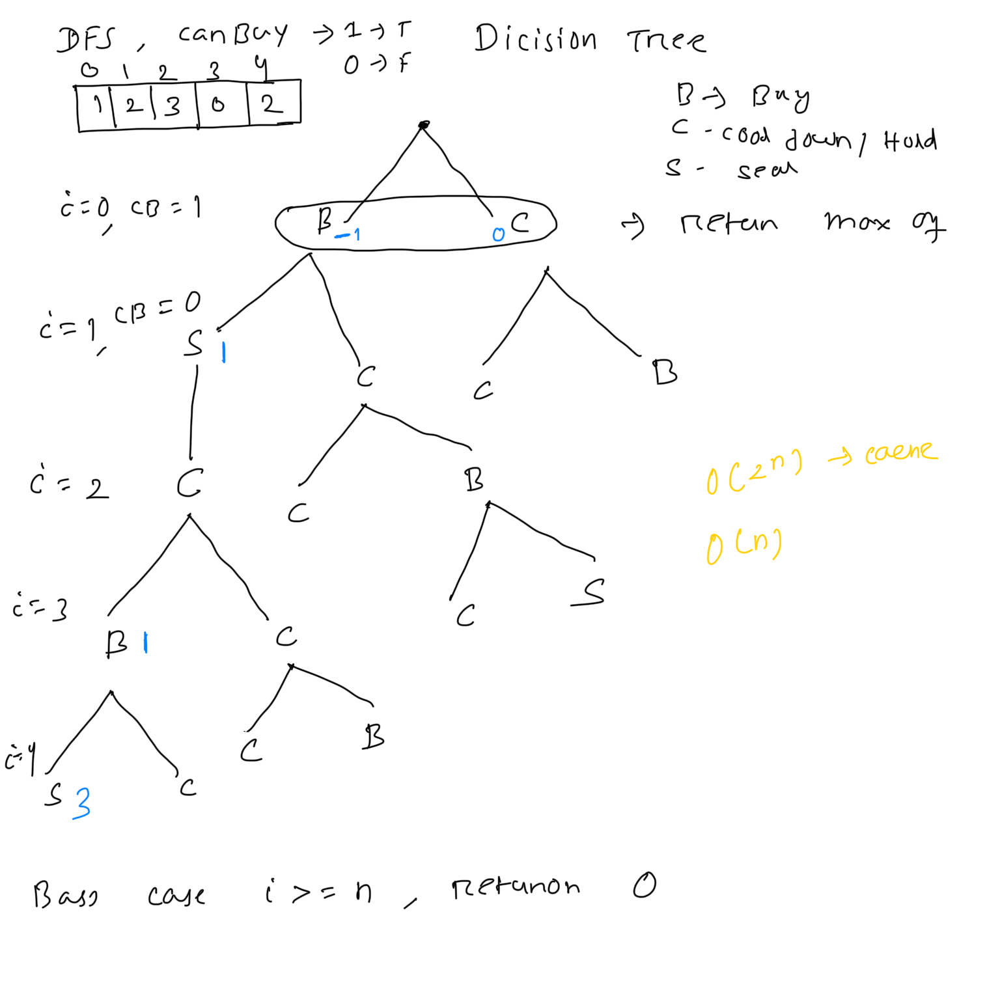
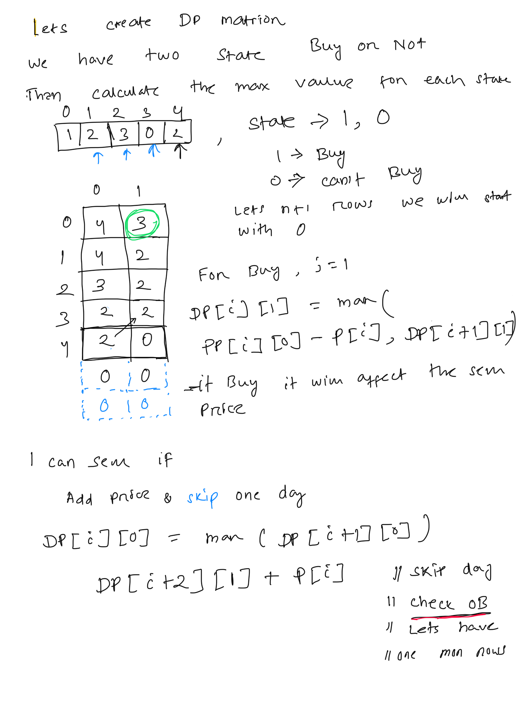

**Best Time to Buy and Sell Stock with Cooldown**  
  
You are given an array prices where prices[i] is the price of a given stock on the ith day.  
Find the maximum profit you can achieve. You may complete as many transactions as you like (i.e., buy one and sell one share of the stock multiple times) with the following restrictions:  
* After you sell your stock, you cannot buy stock on the next day (i.e., cooldown one day).  
****Note:**** You may not engage in multiple transactions simultaneously (i.e., you must sell the stock before you buy again).  
   
****Example 1:****  
****Input:**** prices = [1,2,3,0,2]  
****Output:**** 3  
****Explanation:**** transactions = [buy, sell, cooldown, buy, sell]  
****Example 2:****  
****Input:**** prices = [1]  
****Output:**** 0  
  
*// buying: true = can buy (don't own stock), false = can sell (own stock)*  
  
  
**// lets try to solve with DFS**  
**// lets have simple state canBuy= true, you can buy, false, you can sell, have stock**  
**// after sell skip one day, as cooldown and make canBuy as true again**  
public int maxProfixDFS(int[] prices, int i, boolean canBuy){  
    int profit=0;  
    if(i>=prices.length){  
      return  0;  
    }  
    if(canBuy){  
        **// two choice, buy or colldonw**  
**        **int buy=maxProfixDFS(prices, i+1, false)-prices[i];  
        int skip=maxProfixDFS(prices, i+1, true);  
        profit= Math.**max**(buy,skip);  
  
    }else{  
        int sell=maxProfixDFS(prices, i+2, true)+prices[i]; **//skip one day can't buy immediately**  
**        **int hold=maxProfixDFS(prices, i+1, false);  
        profit= Math.**max**(sell,hold);  
    }  
    return  profit;  
}  
  
With DP for optimisation  
  
**// 1 = canBuy**  
**//0 = no**  
public int maxProfixDFSWithDP(int[] prices, int i, int canBuy, Integer[][] dp){  
    int profit=0;  
    if(i>=prices.length){  
        return  0;  
    }  
    if(dp[i][canBuy] !=null){  
        return  dp[i][canBuy];  
    }  
    if(canBuy==1){  
        **// two choice, buy or colldonw**  
**        **int buy=maxProfixDFSWithDP(prices, i+1, 0,dp)-prices[i];  
        int skip=maxProfixDFSWithDP(prices, i+1, 1,dp);  
        profit= Math.**max**(buy,skip);  
  
    }else{  
        int sell=maxProfixDFSWithDP(prices, i+2, 1,dp)+prices[i]; **//skip one day can't buy immediately**  
**        **int hold=maxProfixDFSWithDP(prices, i+1, 0,dp);  
        profit= Math.**max**(sell,hold);  
    }  
    dp[i][canBuy]=profit;  
    return  profit;  
}  
  
  
public int maxProfit(int[] prices) {  
    **//return  maxProfixDFS(prices,0,true);**  
**    **Integer[][] dp= new Integer[prices.length][2];  
    return  maxProfixDFSWithDP(prices,0,1,dp);  
}  
  
How to solve this now with DP using the Bottom up approach, we have i and canBuy with True or False  
  
dp[i][1]: Max profit from day i onwards when you can buy (don't own stock)  
dp[i][0]: Max profit from day i onwards when you cannot buy (own stock, can sell)  
  
The array has 2 extra slots because:  
When selling at the last day, you reference dp[i+2][1] (cooldown day)  
Without +2, you'd get an index out of bounds error  
The extra slots are initialized to 0 (base case: no more days = 0 profit)  
  
  
public int bottomUp(int[] prices){  
    int [][] dp= new int[prices.length+2][2];  
    for(int i=prices.length-1; i>=0; --i){  
        dp[i][1]=Math.**max**(dp[i+1][1], // skip today  
                dp[i+1][0]-prices[i]); // buy today and pay price  
        dp[i][0]= Math.**max**(dp[i+1][0], // skip today  
                dp[i+2][1] + prices[i]); // Sell today  
    }  
    return dp[0][1];// return buy choice  
}  
