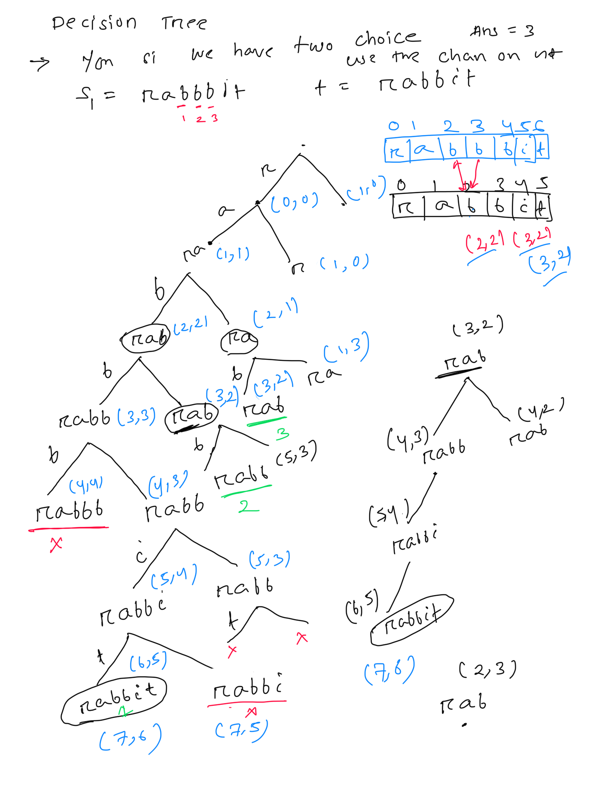
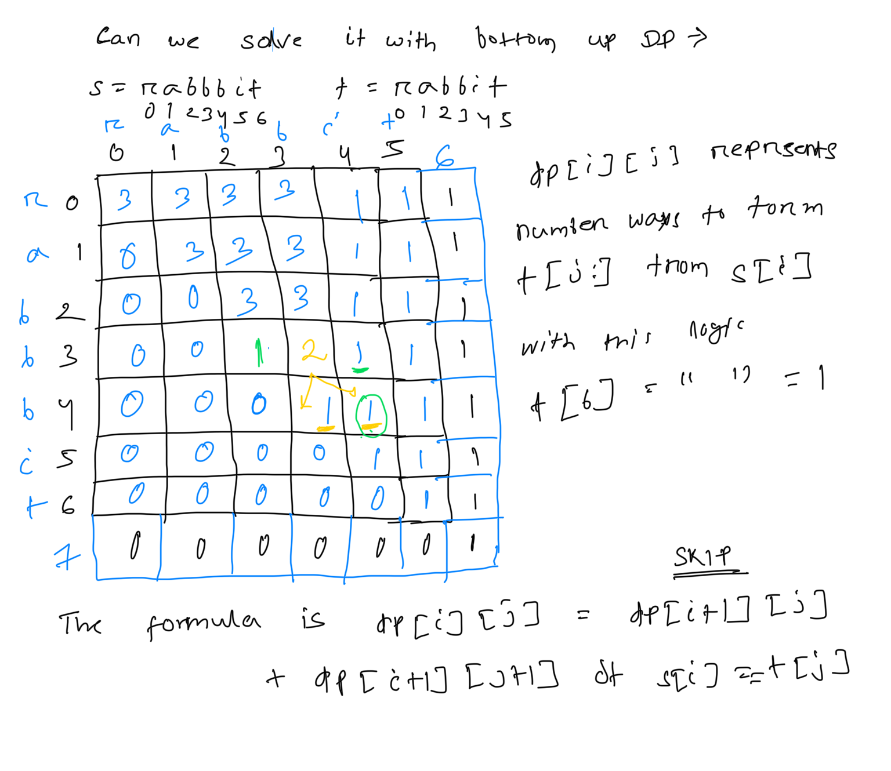

**Distinct Subsequences**  
  
Given two strings s and t, return **the number of distinct** ******subsequences******** of **s** which equals **t.  
The test cases are generated so that the answer fits on a 32-bit signed integer.  
   
****Example 1:****  
****Input:**** s = "rabbbit", t = "rabbit"  
****Output:**** 3  
****Explanation:****  
As shown below, there are 3 ways you can generate "rabbit" from s.  
****++rabb++****b****++it++****  
****++ra++****b****++bbit++****  
****++rab++****b****++bit++****  
****Example 2:****  
****Input:**** s = "babgbag", t = "bag"  
****Output:**** 5  
****Explanation:****  
As shown below, there are 5 ways you can generate "bag" from s.  
****++ba++****b****++g++****bag  
****++ba++****bgba****++g++****  
****++b++****abgb****++ag++****  
ba****++b++****gb****++ag++****  
babg****++bag++****  
  
  
public int numDistinct(String s, String t) {  
    int count=0;  
    // we need to start the DFS from the match first char  
    Integer[][] dp = new Integer[s.length()][t.length()];  
    return dfsCheck( s, t, 0, 0,dp);  
}  
  
  
// Here i is to track the char from s  
// j is to track how much we have made for t  
public Integer dfsCheck(String s, String t, int i, int j, Integer[][] dp){  
   // base case if i >= s.length , 0  
   // if current string match with t, which means j >=t.length  
   // if s[i] not match with t[j] return 0  
    int count=0;  
    if( j >= t.length() ){ // able to create the full word  
        return  1;  
    }  
  
    if(i>=s.length()){  
        return  0;  
    }  
    if(dp[i][j] != null){  
        return  dp[i][j];  
    }  
    // Always have option to skip current character in s  
    count += dfsCheck(s, t, i+1, j, dp);  
  
    // Only advance j if characters match  
    if(s.charAt(i) == t.charAt(j)){  
        count += dfsCheck(s, t, i+1, j+1, dp);  
    }  
    dp[i][j]=count;  
    return  count;  
}  
  
public int usingDPBottomUp(String s, String t){  
    int[][] dp = new int[s.length()+1][t.length()+1];  
    //For all i, set dp[i][n] = 1  
    //This means there is exactly one way to form an empty string t (by choosing nothing)  
    for(int i=0; i<dp.length; ++i){  
        dp[i][t.length()]=1;  
    }  
    for(int i=s.length()-1; i>=0; --i){  
        for (int j=t.length()-1; j>=0; --j){  
            dp[i][j]= dp[i+1][j] /*we can always skip the char*/  
            + (s.charAt(i)==t.charAt(j) ? dp[i+1][j+1] : 0);  
        }  
    }  
    return dp[0][0];  
}  
