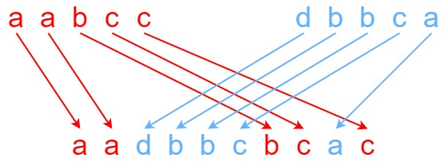
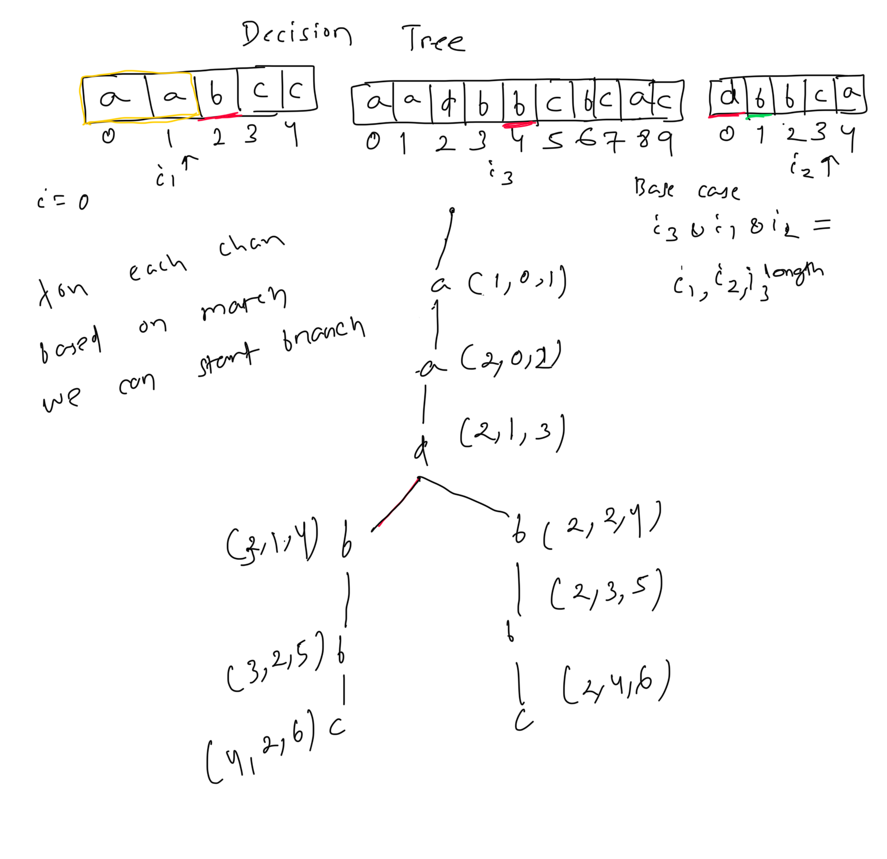
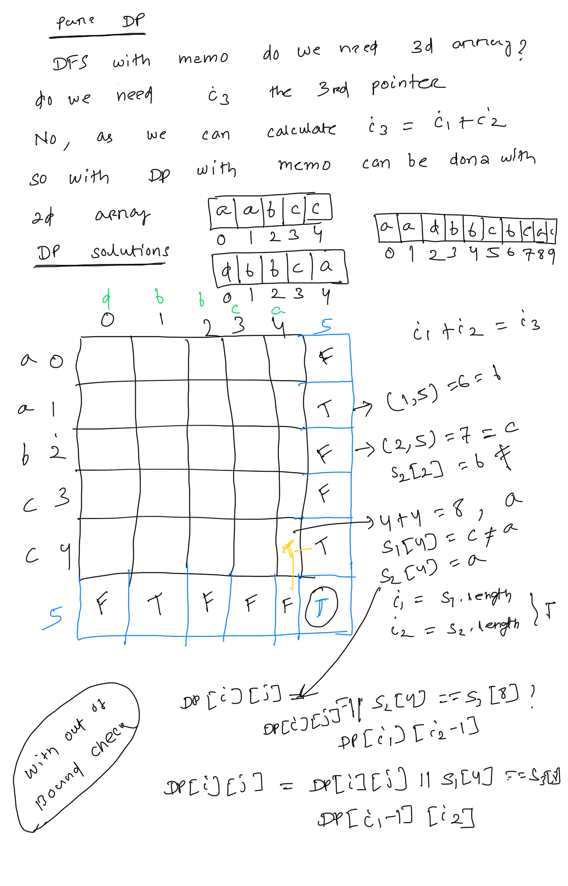

****Interleaving String****  
Given strings s1, s2, and s3, find whether s3 is formed by an ****interleaving**** of s1 and s2.  
An ****interleaving**** of two strings s and t is a configuration where s and t are divided into n and m respectively, such that:  
* s = s1 + s2 + ... + sn  
* t = t1 + t2 + ... + tm  
* |n - m| <= 1  
* The ****interleaving**** is s1 + t1 + s2 + t2 + s3 + t3 + ... or t1 + s1 + t2 + s2 + t3 + s3 + ...  
****Note:**** a + b is the concatenation of strings a and b.  
   
****Example 1:****  
  
****Input:**** s1 = "aabcc", s2 = "dbbca", s3 = "aadbbcbcac"  
****Output:**** true  
****Explanation:**** One way to obtain s3 is:  
Split s1 into s1 = "aa" + "bc" + "c", and s2 into s2 = "dbbc" + "a".  
Interleaving the two splits, we get "aa" + "dbbc" + "bc" + "a" + "c" = "aadbbcbcac".  
Since s3 can be obtained by interleaving s1 and s2, we return true.  
****Example 2:****  
****Input:**** s1 = "aabcc", s2 = "dbbca", s3 = "aadbbbaccc"  
****Output:**** false  
****Explanation:**** Notice how it is impossible to interleave s2 with any other string to obtain s3.  
****Example 3:****  
****Input:**** s1 = "", s2 = "", s3 = ""  
****Output:**** true  
   
****Constraints:****  
* 0 <= s1.length, s2.length <= 100  
* 0 <= s3.length <= 200  
* s1, s2, and s3 consist of lowercase English letters.  
  
// lets solve with DFS frist with backtracking  
// i1 for s1, i2 for s2 ....  
public boolean DFS(String s1, String s2, String s3, int i1, int i2, int i3){  
    if(i3 >= s3.length() && i2>=s2.length() && i1 >=s1.length()){  
        return  true;  
    }  
    boolean isinter=false;  
    // check the chracter in both s1 and s2 and open branch accordingly.  
    if(i1<s1.length() && i3<s3.length() && s3.charAt(i3) == s1.charAt(i1) )  
        isinter=isinter|| DFS(s1,s2,s3, i1+1,i2, i3+1);  
  
    if(i2<s2.length() && i3<s3.length() && s3.charAt(i3) == s2.charAt(i2))  
        isinter=isinter|| DFS(s1,s2,s3, i1,i2+1, i3+1);  
  
    return isinter;  
}  
  
  
  
// can we improve with memorization  
public boolean DFSWithCahce(String s1, String s2, String s3, int i1, int i2, int i3, Boolean[][][] dp){  
    if(i3 >= s3.length() && i2>=s2.length() && i1 >=s1.length()){  
        return  true;  
    }  
    if(dp[i1][i2][i3] !=null){  
        return dp[i1][i2][i3];  
    }  
    boolean isinter=false;  
    // check the chracter in both s1 and s2 and open branch accordingly.  
    if(i1<s1.length() && i3<s3.length() && s3.charAt(i3) == s1.charAt(i1) )  
        isinter=isinter|| DFSWithCahce(s1,s2,s3, i1+1,i2, i3+1,dp);  
  
    if(i2<s2.length() && i3<s3.length() && s3.charAt(i3) == s2.charAt(i2))  
        isinter=isinter|| DFSWithCahce(s1,s2,s3, i1,i2+1, i3+1,dp);  
    // store in memo  
    dp[i1][i2][i3]= isinter;  
    return isinter;  
}  
  
  
  
public boolean isInterleave(String s1, String s2, String s3) {  
    //return  DFS(s1,s2,s3,0,0,0);  
    //Boolean[][][] dp= new Boolean[s1.length()+1][s2.length()+1][s3.length()+1];  
    //return  DFSWithCahce(s1,s2,s3,0,0,0,dp);  
    Boolean[][] dp= new Boolean[s1.length()+1][s2.length()+1];  
   return DFSWithCahcev2(s1,s2,s3,0,0,dp);  
}  
  
  
  
  
// improve memorization using a 2d array as mathmetically i3 = i1+i2, so we no need to track i3 separtely  
public boolean DFSWithCahcev2(String s1, String s2, String s3, int i1, int i2, Boolean[][] dp){  
    int i3= i1+i2; // i3 has be i1+ i2  
    if(i3 >= s3.length() && i2>=s2.length() && i1 >=s1.length()){  
        return  true;  
    }  
    if(dp[i1][i2] !=null){  
        return dp[i1][i2];  
    }  
    boolean isinter=false;  
    // check the chracter in both s1 and s2 and open branch accordingly.  
  
    if(i1<s1.length() && i3<s3.length() && s3.charAt(i3) == s1.charAt(i1) ){  
        isinter=isinter|| DFSWithCahcev2(s1,s2,s3, i1+1,i2 ,dp);  
        // if true return immediately no need try other branch  
        if(isinter) return true;  
    }  
  
    if(i2<s2.length() && i3<s3.length() && s3.charAt(i3) == s2.charAt(i2)) {  
        isinter = isinter || DFSWithCahcev2(s1, s2, s3, i1, i2 + 1, dp);  
        if(isinter) return true;  
    }  
    // store in memo  
    dp[i1][i2]= isinter;  
    return isinter;  
}  
  
  
..  
// Pure DP solutions  
public boolean DP(String s1, String s2, String s3){  
    // do simple length check  
    if(s1.length()+ s2.length() !=s3.length()){  
        return  false;  
    }  
    // lets have the matrix  
    boolean dp[][]= new boolean[s1.length()+1][s2.length()+1]; // default value is False  
    dp[s1.length()][s2.length()]=true;  
    for(int i1=s1.length(); i1>=0; --i1){  
        for(int i2=s2.length(); i2>=0; --i2){  
           // check the out of bound for s1 and s2 and do the assignment  
           if(i1 < s1.length() && s1.charAt(i1) == s3.charAt(i1+i2)){  
               dp[i1][i2]= dp[i1][i2] || dp[i1+1][i2];  
           }  
            if(i2 < s2.length() && s2.charAt(i2) == s3.charAt(i1+i2)){  
                dp[i1][i2]= dp[i1][i2] || dp[i1][i2+1];  
            }  
        }  
  
    }  
    return dp[0][0];  
}  
