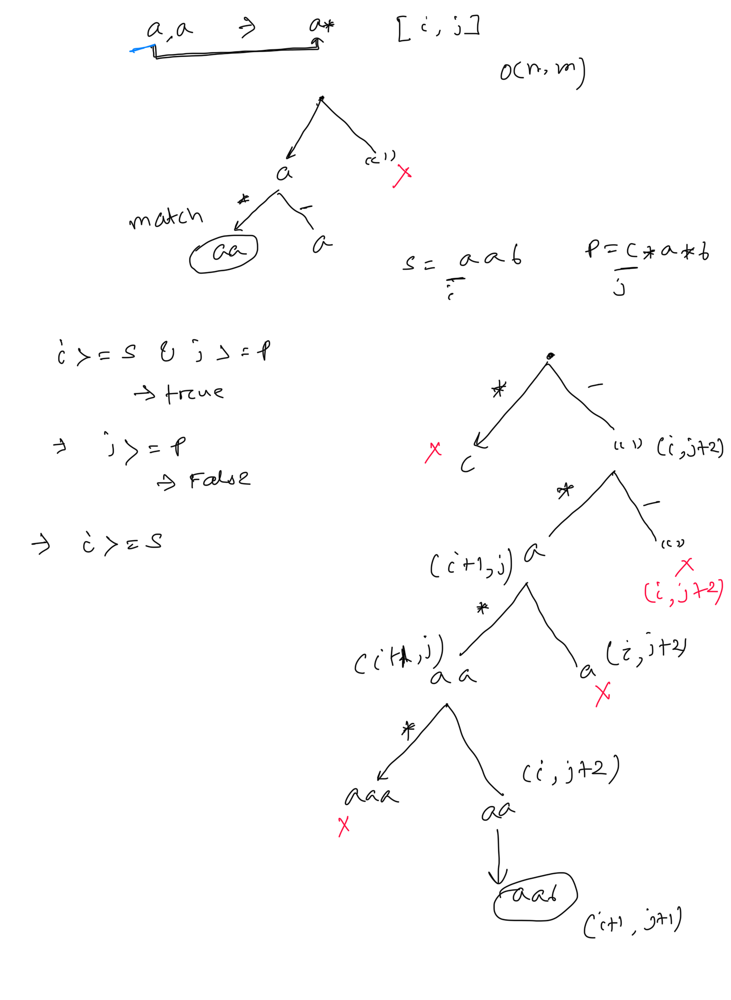

**Regular Expression Matching**  
  
Given an input string s and a pattern p, implement regular expression matching with support for '.' and '*' where:  
* '.' Matches any single character.  
* '*' Matches zero or more of the preceding element.  
Return a boolean indicating whether the matching covers the entire input string (not partial).  
   
**Example 1:**  
**Input:** s = "aa", p = "a"  
**Output:** false  
**Explanation:** "a" does not match the entire string "aa".  
**Example 2:**  
**Input:** s = "aa", p = "a*"  
**Output:** true  
**Explanation:** '*' means zero or more of the preceding element, 'a'. Therefore, by repeating 'a' once, it becomes "aa".  
**Example 3:**  
**Input:** s = "ab", p = ".*"  
**Output:** true  
**Explanation:** ".*" means "zero or more (*) of any character (.)".  
  
  
public boolean isMatch(String s, String p) {  
    return DFSWithMemo(s,p,0,0, new Boolean[s.length()][p.length()]);  
}  
  
public boolean DFSWithMemo(String s, String p, int i, int j, Boolean[][] dp){  
    boolean isMatch=false;  
    // base case  
    if(i>=s.length() && j>=p.length()){  
        return true;  
    }  
    if(j>= p.length()){  
        return  false;  
    }  
    if(i>= s.length()){ // new check if P has only .* char left  
        // remaining pattern must be able to match empty string  
        while(j < p.length()-1){  
            if(p.charAt(j+1) != '*') return false;  
            j += 2; // skip 2 position  
        }  
        return j >= p.length(); // J reach end, return true  
    }  
    // check DP  
    if(dp[i][j] !=null){  
        return  dp[i][j];  
    }  
    // run DFS for this position  
    // look for * case first  
    if(j < p.length()-1 && p.charAt(j+1) == '*'){  
        // we have two choice not use the char or use multiple time  
        // case not use  
        isMatch= isMatch|| DFSWithMemo(s,p,i, j+2, dp);  
        // use the char and check it is match  
        if((s.charAt(i)==p.charAt(j) || p.charAt(j)=='.')){ // if match then use it  
            isMatch= isMatch|| DFSWithMemo(s,p,i+1, j, dp);  
        }  
    }  
    else if(s.charAt(i) ==p.charAt(j) || (p.charAt(j) =='.')){  
        isMatch = isMatch || DFSWithMemo(s, p, i + 1, j + 1, dp);  
    }  
    dp[i][j]=isMatch;  
    return  isMatch;  
}  
