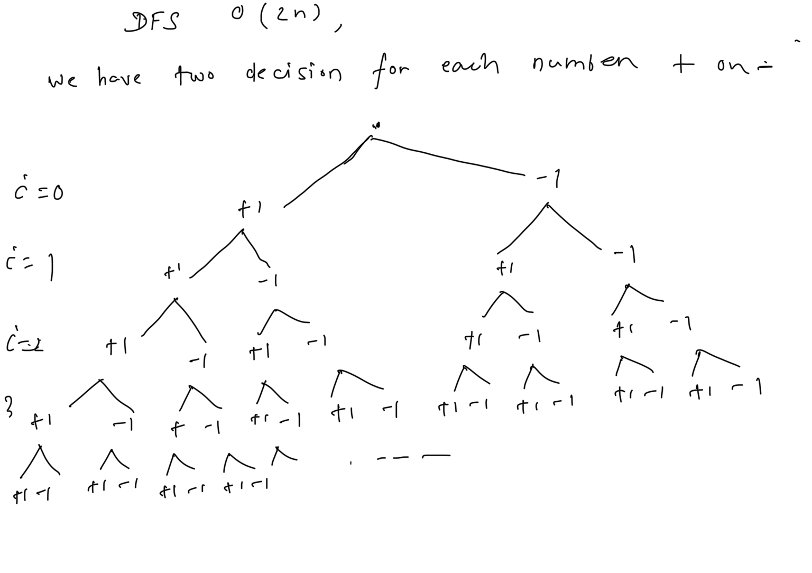
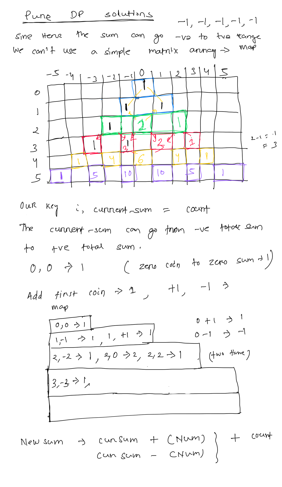

**Target Sum**  
You are given an integer array nums and an integer target.  
You want to build an ****expression**** out of nums by adding one of the symbols '+' and '-' before each integer in nums and then concatenate all the integers.  
* For example, if nums = [2, 1], you can add a '+' before 2 and a '-' before 1 and concatenate them to build the expression "+2-1".  
Return the number of different ****expressions**** that you can build, which evaluates to target.  
  
****Example 1:****  
****Input:**** nums = [1,1,1,1,1], target = 3  
****Output:**** 5  
****Explanation:**** There are 5 ways to assign symbols to make the sum of nums be target 3.  
-1 + 1 + 1 + 1 + 1 = 3  
+1 - 1 + 1 + 1 + 1 = 3  
+1 + 1 - 1 + 1 + 1 = 3  
+1 + 1 + 1 - 1 + 1 = 3  
+1 + 1 + 1 + 1 - 1 = 3  
****Example 2:****  
****Input:**** nums = [1], target = 1  
****Output:**** 1  
  
  
**//Time complexity: O(2^n)**  
**//Space complexity: O(n)**  
public int DFS(int[] nums, int target, int i){  
    **// base case**  
**    **if(i >= nums.length){  
        return  target==0 ?1:0;  
    }  
    int count=0;  
    **// two choice, + or - for the current number**  
**    **count=count+ DFS(nums,target+nums[i],i+1);  
    count=count+ DFS(nums,target-nums[i],i+1);  
    return count;  
}  
  
**// here lets use Map, as the target can go + or -**  
public int DFSWithCache(int[] nums, int target, int i, Map<String, Integer> cache){  
    **// base case**  
**    **if(i >= nums.length){  
        return  target==0 ?1:0;  
    }  
    **// we have the value in cache return from cache**  
**    **if(cache.get(i+","+target) !=null){  
        return cache.get(i+","+target);  
    }  
    int count=0;  
    **// two choice, + or - for the current number**  
**    **count=count+ DFSWithCache(nums,target+nums[i],i+1,cache);  
    count=count+ DFSWithCache(nums,target-nums[i],i+1,cache);  
    **// cache the result**  
**    **cache.put(i+","+target,count); **// use comma to avoid the key collision**  
**    **return count;  
}  
  
public int findTargetSumWays(int[] nums, int target) {  
    Map<String, Integer> cache= new HashMap<>();  
    **//return DFS(nums,target,0);**  
**    **return DFSWithCache(nums,target,0,cache);  
}  
  
  
public int CountWithDpV1(int[] nums, int target){  
    **// we can use an array to store the matrix, as the current sum can go -total_sum to + total_sum**  
**    // Hance lets use a Map to store the required key for each index.**  
**    **Map<String, Integer> countMap= new HashMap<>();  
    countMap.put(0+","+0 ,1); **// zero coin with 0 sum can be done in one ways**  
**    // now for each index, itrate over the keys and add the new one**  
**    **for(int i=1; i < nums.length+1; ++i){  
        Map<String, Integer> tempMap= new HashMap<>();  
        for(Map.Entry<String, Integer> entry: countMap.entrySet()){  
            **// do + and -1 for each entry**  
**            **int curSum = Integer.**valueOf**(entry.getKey().split(",")[1]);  
            int curCount=entry.getValue();  
            String key1= i+"," +(curSum+nums[i-1]); **// + case**  
**            **String key2= i+"," +(curSum-nums[i-1]); **// - case**  
  
**            **tempMap.put(key1, curCount + tempMap.getOrDefault(key1, 0));  
            tempMap.put(key2, curCount + tempMap.getOrDefault(key2, 0));  
  
        }  
        countMap=tempMap;  
    }  
    return countMap.getOrDefault(nums.length+"," + target, 0);  
}  
  
// we can optimise more  
  
**// Here we can use simple Map with key curSum, we do not need the index**  
public int CountWithDp(int[] nums, int target){  
    **// we can use an array to store the matrix, as the current sum can go -total_sum to + total_sum**  
**    // Hance lets use a Map to store the required key for each index.**  
**    **Map<Integer, Integer> countMap= new HashMap<>();  
    countMap.put(0 ,1); **// zero sum with 1 coin**  
**    // now for each index, itrate over the keys and add the new one**  
**    **for(int i=1; i < nums.length+1; ++i){  
        Map<Integer, Integer> tempMap= new HashMap<>();  
  
        for(Map.Entry<Integer, Integer> entry: countMap.entrySet()){  
            **// do + and -1 for each entry**  
**            **int curSum = entry.getKey();  
            int curCount=entry.getValue();  
            int newSum1=curSum+nums[i-1];  
            int newSum2=curSum-nums[i-1];  
  
            tempMap.put(newSum1, curCount + tempMap.getOrDefault(newSum1, 0));  
            tempMap.put(newSum2, curCount + tempMap.getOrDefault(newSum2, 0));  
  
        }  
        countMap=tempMap;  
    }  
    return countMap.getOrDefault(target,0);  
}  
  
