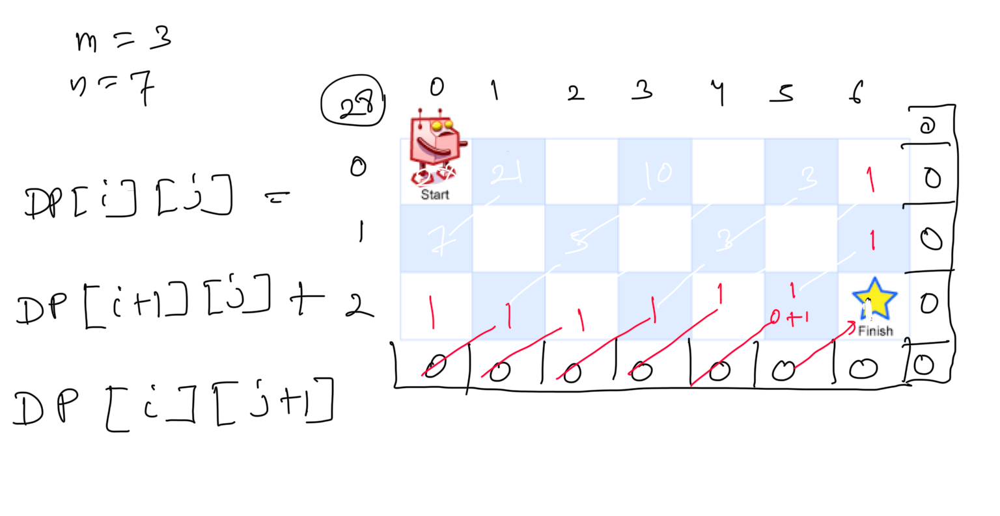

**Unique Paths**  
https://neetcode.io/problems/count-paths/solution  
There is a robot on an m x n grid. The robot is initially located at the ****top-left corner**** (i.e., grid[0][0]). The robot tries to move to the ****bottom-right corner**** (i.e., grid[m - 1][n - 1]). The robot can only move either down or right at any point in time.  
Given the two integers m and n, return **the number of possible unique paths that the robot can take to reach the bottom-right corner**.  
The test cases are generated so that the answer will be less than or equal to 2 * 109.  
   
****Example 1:****  
****Input:**** m = 3, n = 7  
****Output:**** 28  
****Example 2:****  
****Input:**** m = 3, n = 2  
****Output:**** 3  
****Explanation:**** From the top-left corner, there are a total of 3 ways to reach the bottom-right corner:  
1. Right -> Down -> Down  
2. Down -> Down -> Right  
3. Down -> Right -> Down  
  
public int uniquePathsv(int m, int n) {  
    **// lets calculate the value row wise, as we see m-1, row all value is 1**  
**    // start value for all row is 1**  
**    **int [] row= new int[n];  
    Arrays.**fill**(row,1);  
    **// create the rows for all the column**  
**    **for(int i=m-2; i>=0; --i){  
        for(int j=n-2; j>=0; --j){  
            row[j]=row[j]+row[j+1];  
        }  
    }  
    return row[0];  
}  
  
public int uniquePathsv1(int m, int n) {  
    **// lets calculate the value row wise, as we see m-1, row all value is 1**  
**    // start value for all row is 1**  
**    **int [] row= new int[n];  
    Arrays.**fill**(row,1);  
    **// create the rows for all the column**  
**    **for(int i=m-2; i>=0; --i){  
        **// we can update the same row in place**  
**        **int[] tempRow= new int[n];  
        tempRow[n-1]=1;  
        for(int j=n-2; j>=0; --j){  
            tempRow[j]=row[j]+tempRow[j+1];  
        }  
       row=tempRow;  
    }  
    return row[0];  
}  
public int uniquePathsv2(int m, int n) {  
    **// last row and last col is 1**  
**    **int[][] dp= new int[m][n];  
   dp[m-1][n-1]=1;  
  
    **// create the rows for all the column**  
**    **for(int i=m-2; i>=0; --i){  
        for(int j=n-2; j>=0; --j){  
            dp[i][j]= dp[i+1][j]+dp[i][j+1];  
        }  
    }  
    return dp[0][0];  
}  
