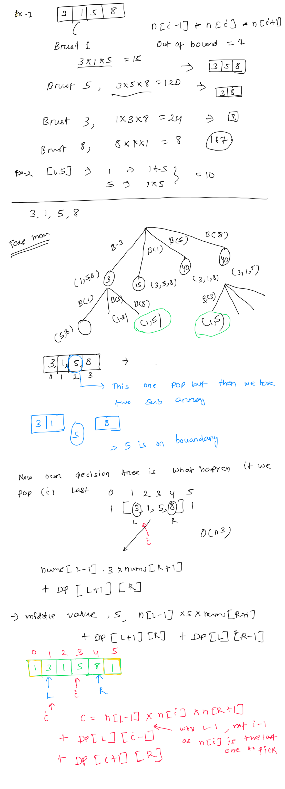

**Burst Balloons**  
you are given n balloons, indexed from 0 to n - 1. Each balloon is painted with a number on it represented by an array nums. You are asked to burst all the balloons.  
If you burst the ith balloon, you will get nums[i - 1] * nums[i] * nums[i + 1] coins. If i - 1 or i + 1 goes out of bounds of the array, then treat it as if there is a balloon with a 1 painted on it.  
Return **the maximum coins you can collect by bursting the balloons wisely**.  
   
****Example 1:****  
****Input:**** nums = [3,1,5,8]  
****Output:**** 167  
****Explanation:****  
nums = [3,1,5,8] --> [3,5,8] --> [3,8] --> [8] --> []  
coins =  3*1*5    +   3*5*8   +  1*3*8  + 1*8*1 = 167  
****Example 2:****  
****Input:**** nums = [1,5]  
****Output:**** 10  
  
  
public int maxCoins(int[] nums) {  
public int maxCoins(int[] nums) {  
    // lets 1 and 1 to left and right of the nums for easy caluclation  
    // lets 1 and 1 to left and right of the nums for easy caluclation  
    int [] n= new int[nums.length+2];  
    int [] n= new int[nums.length+2];  
    n[0]=1;  
    n[0]=1;  
    n[n.length-1]=1;  
    n[n.length-1]=1;  
    for(int i=0; i < nums.length; ++i){  
    for(int i=0; i < nums.length; ++i){  
        n[i+1]=nums[i]; // copy the value  
    }  
    }  
    Integer[][] dp = new Integer[n.length][n.length]; // we use HashMap also  
    Integer[][] dp = new Integer[n.length][n.length]; // we use HashMap also  
    return  DFS(n,1,n.length-2,dp);  
    return  DFS(n,1,n.length-2,dp);  
}  
public int DFS(int[] n, int l, int r, Integer[][] dp){  
public int DFS(int[] n, int l, int r, Integer[][] dp){  
    // base case if l> r, return 0  
    // base case if l> r, return 0  
    if(l>r){  
    if(l>r){  
        return 0;  
    }  
    // if in DP return the value  
    if(dp[l][r] !=null){  
    if(dp[l][r] !=null){  
        return  dp[l][r];  
        return  dp[l][r];  
    }  
    // now for each value from L to R, consider this is pop last and create the sub problem and take max  
    // now for each value from L to R, consider this is pop last and create the sub problem and take max  
    int coins=0;  
    int coins=0;  
    dp[l][r]=0;  
    for(int i = l; i <=r; ++i){  
    for(int i = l; i <=r; ++i){  
        coins= n[l-1]*n[i]*n[r+1]; // l-1 and r+1, as this the last item to pick  
        coins+= DFS(n,l, i-1,dp) + DFS(n,i+1,r,dp);  
        coins+= DFS(n,l, i-1,dp) + DFS(n,i+1,r,dp);  
        dp[l][r]= Math.**max**(dp[l][r], coins);  
    }  
    return dp[l][r];  
}  
