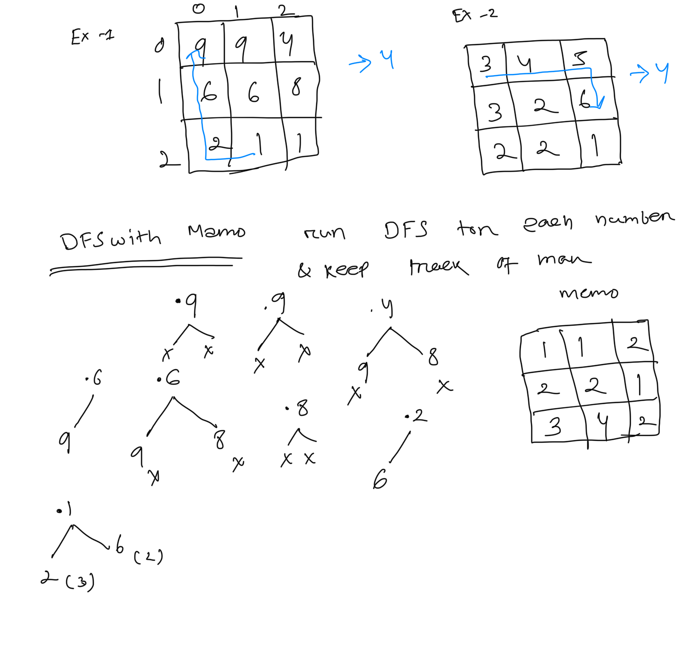
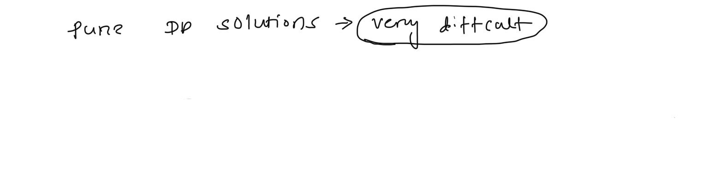

**Longest Increasing Path in Matrix**  
Given an m x n integers matrix, return **the length of the longest increasing path in **matrix.  
From each cell, you can either move in four directions: left, right, up, or down. You ****may not**** move ****diagonally**** or move ****outside the boundary**** (i.e., wrap-around is not allowed).  
   
****Example 1:****  
****Input:**** matrix = [[9,9,4],[6,6,8],[2,1,1]]  
****Output:**** 4  
****Explanation:**** The longest increasing path is [1, 2, 6, 9].  
****Example 2:****  
  
****Input:**** matrix = [[3,4,5],[3,2,6],[2,2,1]]  
****Output:**** 4  
****Explanation: ****The longest increasing path is [3, 4, 5, 6]. Moving diagonally is not allowed.  
****Example 3:****  
****Input:**** matrix = [[1]]  
****Output:**** 1  
  
  
public int DFSwithMemo(int[][] matrix, int i, int j, Integer[][] dp){  
    int [][] dir= {{0,1}, {1,0}, {0,-1}, {-1,0}};  
    if(dp[i][j] !=null ){  
        return dp[i][j];  
    }  
    int count=1;  
    // check for all 4 direction and call DFS  
    int value=0;  
    for(int d[] : dir){  
        int ni= i+d[0];  
        int nj=j+d[1];  
        if( ni < matrix.length && nj < matrix[0].length && ni>=0 && nj >=0 &&  
        matrix[ni][nj] > matrix[i][j]) {  
            value=Math.**max**(value,DFSwithMemo(matrix,ni,nj, dp));  
        }  
    }  
    count=count+value;  
    dp[i][j]=count;  
    return  count;  
}  
  
public int longestIncreasingPath(int[][] matrix) {  
    Integer[][] dp = new Integer[matrix.length][matrix[0].length];  
    int count = 0;  
    for (int i = 0; i < matrix.length; ++i) {  
        for (int j = 0; j < matrix[0].length; ++j) {  
            count = Math.**max**(count, DFSwithMemo(matrix, i, j, dp));  
        }  
    }  
    return count;  
}  
  
  
