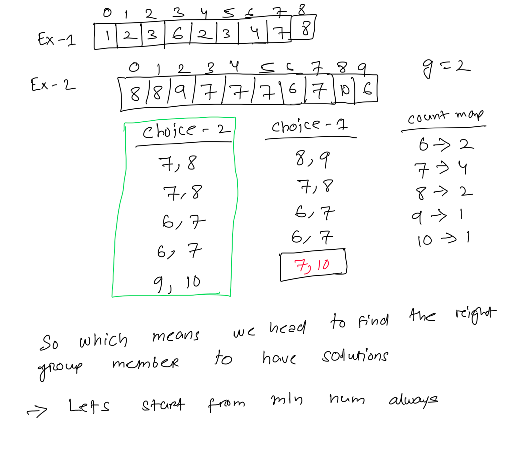
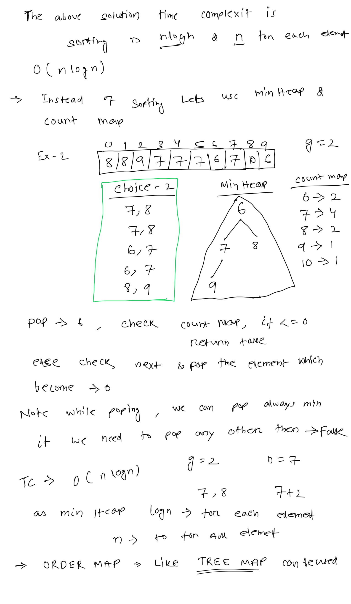

**Hand of Straights**  
Alice has some number of cards and she wants to rearrange the cards into groups so that each group is of size groupSize, and consists of groupSize consecutive cards.  
Given an integer array hand where hand[i] is the value written on the ith card and an integer groupSize, return true if she can rearrange the cards, or false otherwise.  
   
****Example 1:****  
```
Input: hand = [1,2,3,6,2,3,4,7,8], groupSize = 3
Output: true
Explanation: Alice's hand can be rearranged as [1,2,3],[2,3,4],[6,7,8]

```
****Example 2:****  
```
Input: hand = [1,2,3,4,5], groupSize = 4
Output: false
Explanation: Alice's hand can not be rearranged into groups of 4.


```
  
```
public boolean isNStraightHand(int[] hand, int groupSize) {
    // do a basic check, hand size has to be multiple of groupsize
    if(hand.length%groupSize !=0){
        return  false;
    }
    int groupCount=hand.length/groupSize;
    // Lets create a mapping with number and their count
    Map<Integer, Integer> countMap= new HashMap<>();
    Arrays.sort(hand); // always start from min num
    // which means if we can not create a group from that num then we can return false
    // no need to check more
    for(int i: hand){
        countMap.put(i, countMap.getOrDefault(i,0)+1);
    }
    // start creating the group, total elements, groupPosition.
    // try to pick the first element and see if group can be created or not, like bruteforce
    int gc=0;
    for(int n1: hand){
        int count=countMap.getOrDefault(n1,0);
        // create the group
        if(count<=0){
            //skip it is used
            continue;
        }
        countMap.put(n1,countMap.getOrDefault(n1,0)-1);
        for(int i=1; i<=groupSize-1; ++i){
            // look for n1+1 and update count, not found break the loop
            int nextNum=n1+i;
            int ni=countMap.getOrDefault(nextNum,0);
            if(ni<=0){
               return  false;// no need to check further
            }
            countMap.put(nextNum,countMap.getOrDefault(nextNum,0)-1);
        }

    }
    // all match found
    return true;
}

```
  
   
