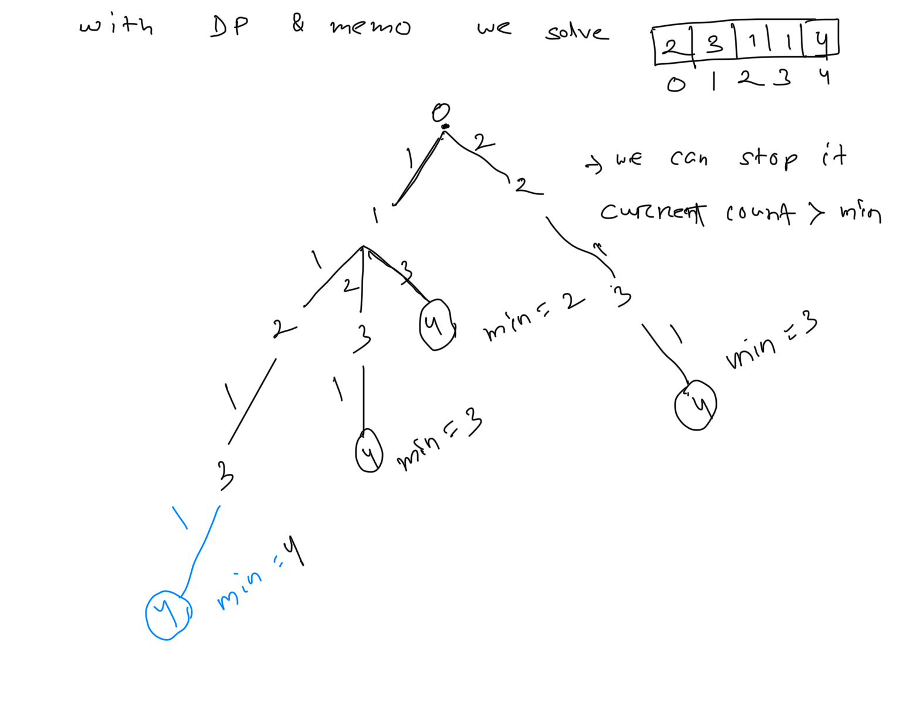
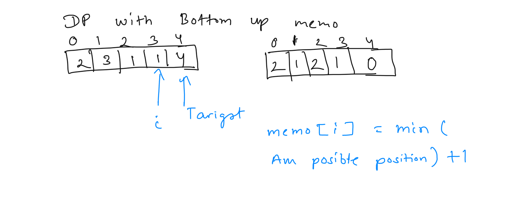
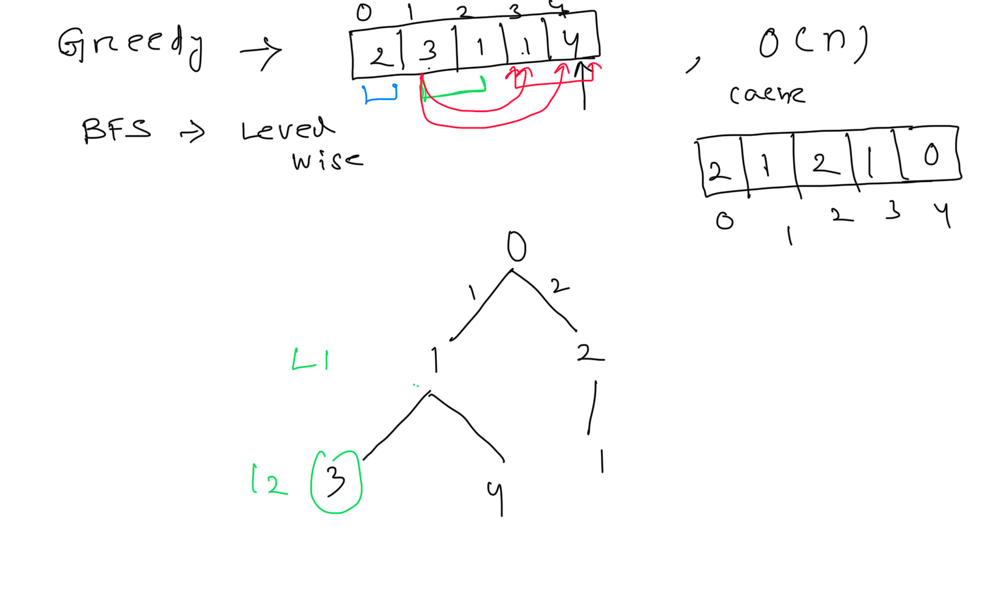
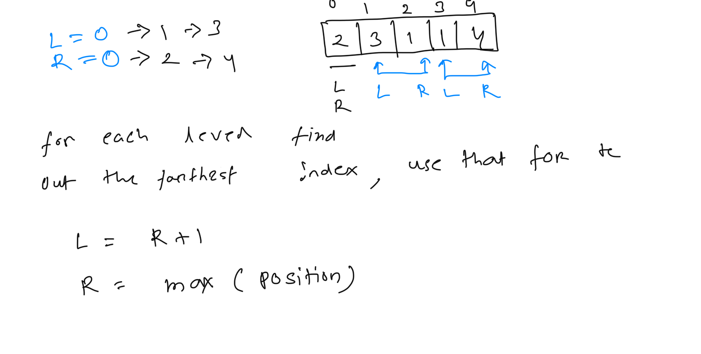

**Jump Game II**  
You are given a **0-indexed** array of integers nums of length n. You are initially positioned at index 0.  
Each element nums[i] represents the maximum length of a forward jump from index i. In other words, if you are at index i, you can jump to any index (i + j) where:  
* 0 <= j <= nums[i] and  
* i + j < n  
Return *the minimum number of jumps to reach index *n - 1. The test cases are generated such that you can reach index n - 1.  
   
**Example 1:**  
**Input:** nums = [2,3,1,1,4]  
**Output:** 2  
**Explanation:** The minimum number of jumps to reach the last index is 2. Jump 1 step from index 0 to 1, then 3 steps to the last index.  
**Example 2:**  
**Input:** nums = [2,3,0,1,4]  
**Output:** 2  
  
  
```
//2,3,1,1,4
public int DFSWithDP(int[] nums, int i, Integer[] memo){
    if(i>= nums.length-1){
        return  0; // reached no more jump
    }
    if(memo[i] !=null){
        return memo[i];
    }
    int min=100000; // not use the MaxValue, as MaxValue +1 will become -ve
    if(nums[i]<=0){
        return 100000;
    }
    // find the end index, no need to do till total size
    int end= Math.min(nums.length-1, i+nums[i]);
    for(int j=1; j <= end; ++j){
        //Find the minimum jumps needed from any of the positions I can jump to,
        // then add 1 for the current jump
        // not min= 1+Math.min(min, DFSWithDP(nums, i +j,memo)), this will add extra  1 to min
        int value=DFSWithDP(nums, i +j,memo);
        min = Math.min(min,  1+DFSWithDP(nums, i +j,memo)); // 1+
    }
    memo[i]=min;
    return  min;
}

```
  
  
```
public int dpBottomUp(int[] nums){
    int[] cache= new int[nums.length];
    for(int i =nums.length-2; i>=0; --i){
        // calculate the min for each step, the formula is min[i] =  1+ min(all reachable position)
        if(nums[i] <=0){
            cache[i]= nums.length+1;
        }
        int min= nums.length+1; // max min possible
        // check all reachable position and choose the min
        int end= Math.min((nums.length-1 -i), nums[i]);
        for(int j=1; j <= end; ++j){
            min=Math.min(min, 1+ cache[i+j]);
        }
        cache[i]=min;
    }
    return cache[0];
}

```
  
  
  
```
// since we need to find the min length, which is like min level
// when we need count the level BFS is the best choice as we traveser level by level and we can
// solve this by o(n) with BFS

public int bfs(int[] nums){
    Queue<Integer> elements= new LinkedList<>();
    elements.offer(0);
    int level=0;
    boolean[] visited= new boolean[nums.length];
    while (!elements.isEmpty()){
        int size= elements.size();
        for(int i=0; i<size; ++i){
            int index=elements.poll();
            if(index== nums.length-1){
                return level;
            }
            visited[index]=true;
            int end=Math.min((nums.length-1 - index), nums[index]);
            for(int j=1; j<= end; ++j){
                if(!visited[i+j]){
                    elements.offer(i+j);
                }
            }
        }
        level++;
    }
    return  level-1;
}

```
```


```
  
  
```
public int greedyBFSOptimise(int[] nums){
    int l=0, r =0;
    int res=0;
    while (r< nums.length-1){
        // choose the max
        int farthest=0;
        for(int i=l; i <=r; ++i){
            farthest=Math.max(farthest, i+nums[i]);
        }
        l=r+1;
        r=farthest;
        res++;
    }
    return res;
}

```
