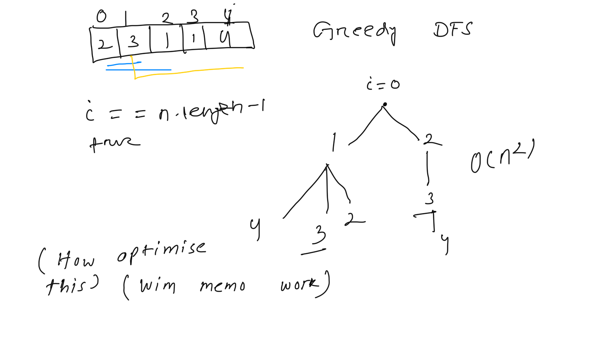
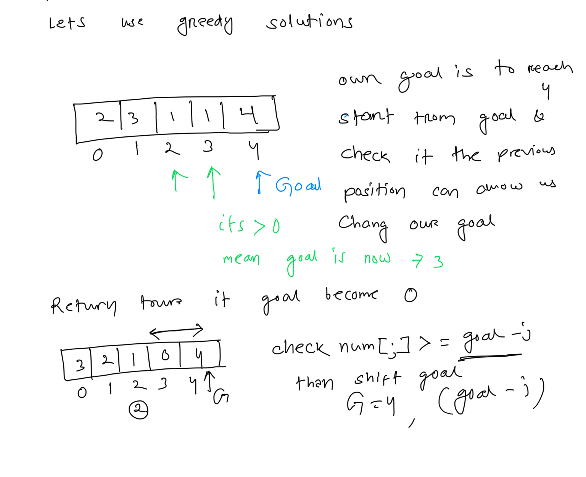

**Jump Game**  
  
You are given an integer array nums. You are initially positioned at the array's **first index**, and each element in the array represents your maximum jump length at that position.  
Return true* if you can reach the last index, or *false* otherwise*.  
   
**Example 1:**  
**Input:** nums = [2,3,1,1,4]  
**Output:** true  
**Explanation:** Jump 1 step from index 0 to 1, then 3 steps to the last index.  
**Example 2:**  
**Input:** nums = [3,2,1,0,4]  
**Output:** false  
**Explanation:** You will always arrive at index 3 no matter what. Its maximum jump length is 0, which makes it impossible to reach the last index.  
  
  
//  DFS with memo Time comepxity is O(n^2)  
public boolean dfs(int[] nums, int i,Boolean[] memo){  
    // base case  
    boolean canJump=false;  
    if(i>= nums.length-1){ // cover the out of Bound  
        return true;  
    }  
    // check memo  
    if(memo[i] !=null){  
        return  memo[i];  
    }  
    int n=nums[i];  
    if(n >0){  
        for(int j=1; j <=n; ++j){  
            canJump= dfs(nums, i+j,memo);  
            memo[i]=canJump;  
            if(canJump) return  true;  
        }  
    }  
    return canJump;  
}  
// How to solve with Greedy  
  
  
// How to solve with Greedy  
public boolean greedy(int[] nums){  
    int goal=nums.length-1;  
    for(int j= nums.length-2; j>=0; --j){  
        if(nums[j] >=goal-j){  
            goal=j;  
        }  
    }  
    return goal==0;  
}  
