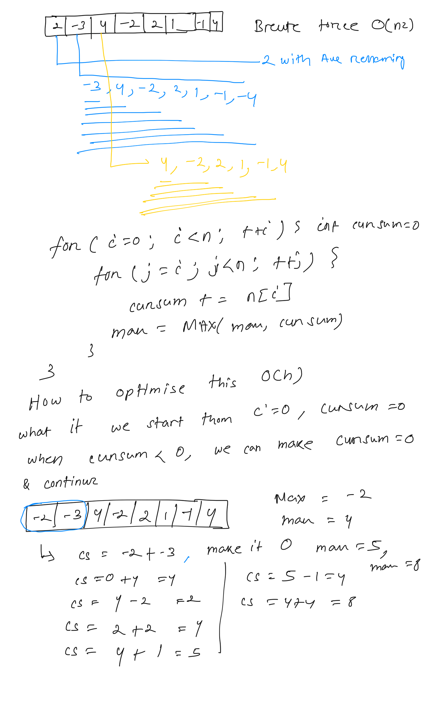

**Maximum Subarray**  
  
Given an array of integers nums, find the subarray with the largest sum and return the sum.  
A ****subarray**** is a contiguous non-empty sequence of elements within an array.  
****Example 1:****  
Input: nums = [2,-3,4,-2,2,1,-1,4]  
  
Output: 8  
Explanation: The subarray [4,-2,2,1,-1,4] has the largest sum 8.  
****Example 2:****  
Input: nums = [-1]  
  
Output: -1  
  
  
public int maxSubArrayOptimise(int[] nums){  
    int max=nums[0];  
    int curSum=nums[0];  
    for(int i=1; i < nums.length; ++i ){  
        if(curSum <0)  
            curSum=0; // discard all element and start from 0 again  
        curSum+=nums[i];  
        max=Math.**max**(max,curSum);  
    }  
    return max;  
}  
public int maxSubArrayBruteForce(int[] nums){  
    int maxSum=nums[0];  
    // lets try all the combination like 2 with all remaining elements  
    // -3 with all remaining elements  
    for(int i=0; i < nums.length; ++i){  
        int curSum=0;  
        for(int j=i; j< nums.length; ++j){  
            curSum+=nums[j];  
            maxSum=Math.**max**(maxSum,curSum);  
        }  
    }  
    return  maxSum;  
}  
  
