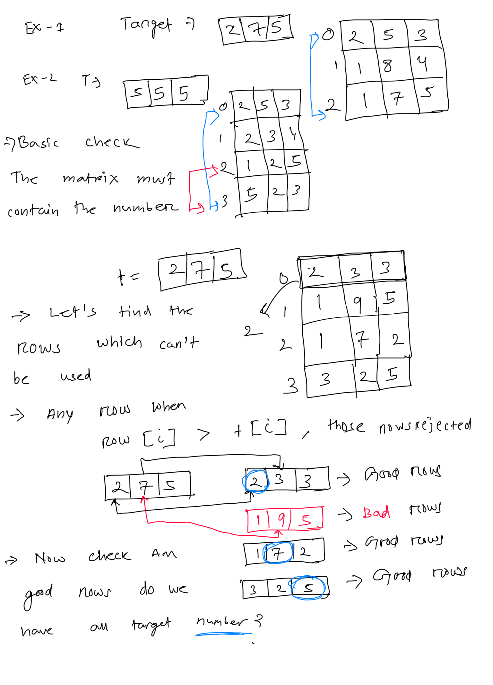

**Merge Triplets to Form Target**  
A ****triplet**** is an array of three integers. You are given a 2D integer array triplets, where triplets[i] = [ai, bi, ci] describes the ith ****triplet****. You are also given an integer array target = [x, y, z] that describes the ****triplet**** you want to obtain.  
To obtain target, you may apply the following operation on triplets ****any number**** of times (possibly ****zero****):  
* Choose two indices (****0-indexed****) i and j (i != j) and ****update**** triplets[j] to become [max(ai, aj), max(bi, bj), max(ci, cj)].  
    * For example, if triplets[i] = [2, 5, 3] and triplets[j] = [1, 7, 5], triplets[j] will be updated to [max(2, 1), max(5, 7), max(3, 5)] = [2, 7, 5].  
Return true **if it is possible to obtain the **target** ****triplet**** **[x, y, z]** as an**** element**** of **triplets**, or **false** otherwise**.  
   
****Example 1:****  
```
Input: triplets = [[2,5,3],[1,8,4],[1,7,5]], target = [2,7,5]
Output: true
Explanation: Perform the following operations:
- Choose the first and last triplets [[2,5,3],[1,8,4],[1,7,5]]. Update the last triplet to be [max(2,1), max(5,7), max(3,5)] = [2,7,5]. triplets = [[2,5,3],[1,8,4],[2,7,5]]
The target triplet [2,7,5] is now an element of triplets.

```
****Example 2:****  
```
Input: triplets = [[3,4,5],[4,5,6]], target = [3,2,5]
Output: false
Explanation: It is impossible to have [3,2,5] as an element because there is no 2 in any of the triplets.

```
****Example 3:****  
```
Input: triplets = [[2,5,3],[2,3,4],[1,2,5],[5,2,3]], target = [5,5,5]
Output: true
Explanation: Perform the following operations:
- Choose the first and third triplets [[2,5,3],[2,3,4],[1,2,5],[5,2,3]]. Update the third triplet to be [max(2,1), max(5,2), max(3,5)] = [2,5,5]. triplets = [[2,5,3],[2,3,4],[2,5,5],[5,2,3]].
- Choose the third and fourth triplets [[2,5,3],[2,3,4],[2,5,5],[5,2,3]]. Update the fourth triplet to be [max(2,5), max(5,2), max(5,3)] = [5,5,5]. triplets = [[2,5,3],[2,3,4],[2,5,5],[5,5,5]].
The target triplet [5,5,5] is now an element of triplets.

```
  
  
```
/**
 *Lets take 3 flags t1, t2, t3
 * For each good rows, (Good rows ->A row which does not contain any greater element from target)
 * check for match, if at any point all 3 true return true, else at the end return false.
 */
public boolean checkEachRow(int[][] triplets, int[] target){
    boolean t1=false, t2=false, t3=false;
    for(int[]t: triplets){
        if(t[0] > target[0] || t[1] > target[1] || t[2] > target[2]){
            continue; // skip the row
        }else{
            // check for match and mark them true
            t1= (t[0]==target[0] || t1);
            t2= (t[1]==target[1] || t2);
            t3= (t[2]==target[2] || t3);
        }
        if(t1 && t2 && t3){
            return true;
        }
    }
    return false;
}
public boolean countGoodRows(int[][] triplets, int[] target){
    // Lets find the good rows, and check if they match, if match just count
    // coloumn wise
    Set<Integer> goodRows= new HashSet<>();
    for(int [] t : triplets){
        if(t[0] > target[0] || t[1] > target[1] || t[2] > target[2]){
            continue; // skip row
        }else{
            // check if the row match any target coloumn, if yes, store that coloumn index
            // we should have exactly 3 value 0,1, and 2
            for(int i=0; i < target.length; ++i){
                if(t[i]== target[i]){
                    goodRows.add(i);
                }
            }
        }
    }
    return goodRows.size()==3;
}
public boolean checkByremovingBadrows(int[][] triplets, int[] target){
    // Lets remove the triplet which are not eligble, the logic is any triplet which contain a > greater number
    // in the same coloumn
    Set<Integer> notElgibleRows= new HashSet<>();
    for(int i=0; i< triplets.length; ++i){
        for(int j=0;  j < triplets[i].length; ++j){
            if(triplets[i][j] > target[j]){
                notElgibleRows.add(i); // add the row, break the inner loop
                break;
            }
        }
    }
    // now check the reaming row should have the elements
    // lets do coloumn wise
    for(int j=0; j< target.length; ++j ){
        boolean found=false;
        for (int i=0; i < triplets.length; ++i){
            if(notElgibleRows.contains(i)){
                continue; //skip this row
            }
            if(target[j]==triplets[i][j]){
                found=true;
            }
        }
        if (!found){
            return false;
        }
    }
    return true;
}

```
