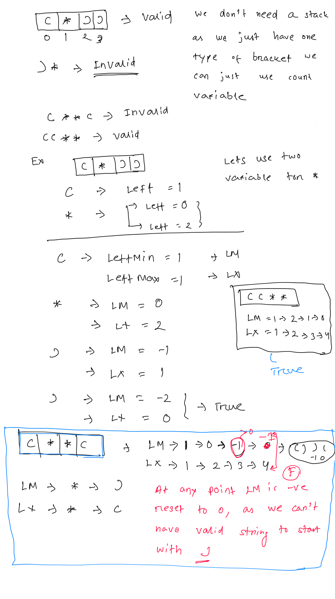
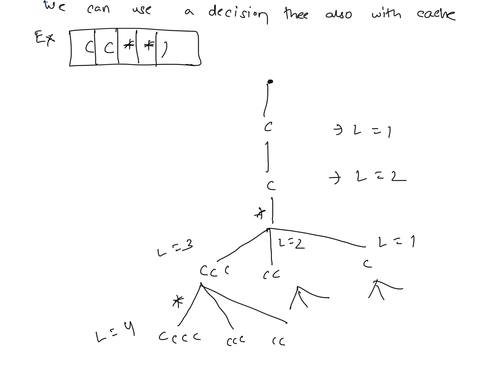

**Valid Parenthesis String**  
Given a string s containing only three types of characters: '(', ')' and '*', return true **if** s **is ****valid******.  
The following rules define a ****valid**** string:  
* Any left parenthesis '(' must have a corresponding right parenthesis ')'.  
* Any right parenthesis ')' must have a corresponding left parenthesis '('.  
* Left parenthesis '(' must go before the corresponding right parenthesis ')'.  
* '*' could be treated as a single right parenthesis ')' or a single left parenthesis '(' or an empty string "".  
   
****Example 1:****  
```
Input: s = "()"
Output: true

```
****Example 2:****  
```
Input: s = "(*)"
Output: true

```
****Example 3:****  
```
Input: s = "(*))"
Output: true

```
  
  
```
// greedy solutions
public  boolean greedy(String s){
    // Since the * can be -> ( or ) or empty
    // so lets have two variable for to store the count of left open, one min and another max
    // if max is negative return false
    // at end if any is 0 return true
    int lm=0 ,lx=0;
    for(int i=0; i < s.length(); ++i){
        if(s.charAt(i) =='('){
            // no choice incriment both
            lx++; lm++;
        }else if (s.charAt(i) ==')'){
            // no choice
            lx--; lm--;
        }else{
            // two choice of bracket ( )
            lm --; lx++;
        }
        if(lx <0){
            return  false;
        }
        if(lm < 0){
            lm =0; // reset to 0 as we can not have string start with )
        }
    }
    return lx==0 || lm ==0;
}

```
  
  
```
public boolean dfsWithCache(String s, int left, int i, Boolean[][] dp){
    // base case
    boolean isValid=false;
    if (left < 0) return false;
    if (i == s.length()) return left == 0;
    // check dp
    if(dp[i][left] !=null){
        return dp[i][left];
    }
    if(s.charAt(i) =='('){
        isValid=isValid|| dfsWithCache(s, left+1, i+1,dp);
    }else if (s.charAt(i) ==')'){
        isValid=isValid|| dfsWithCache(s, left-1, i+1,dp);
    }else{
        // 3 branch for *
        isValid=isValid || dfsWithCache(s, left-1, i+1,dp);
        isValid=isValid || dfsWithCache(s, left+1, i+1,dp);
        isValid=isValid || dfsWithCache(s, left, i+1,dp);
    }
    dp[i][left]=isValid;
    return  isValid;
}

```
